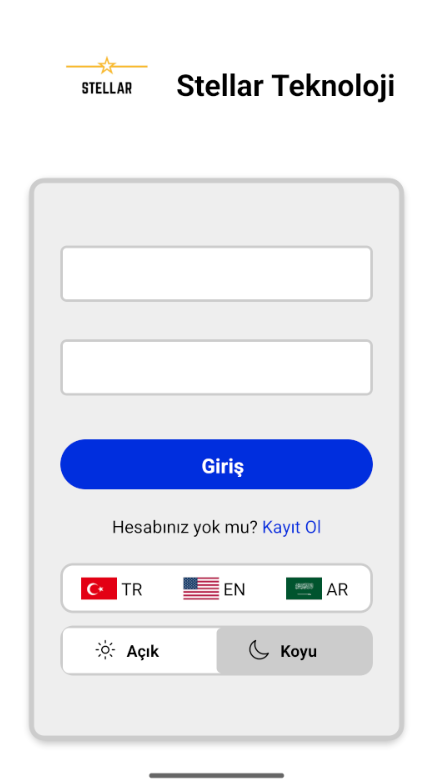
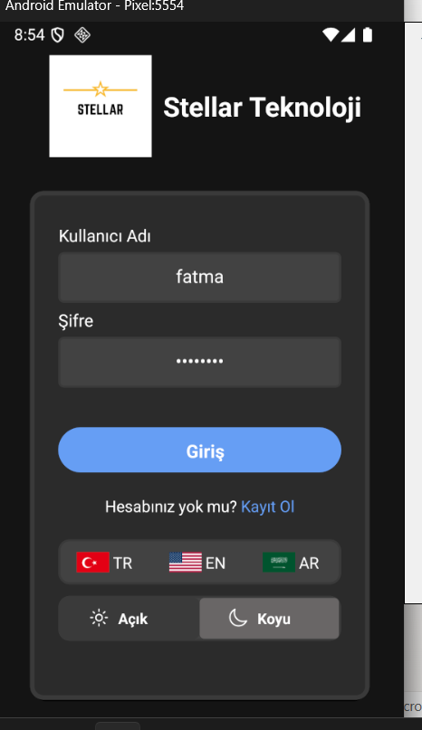
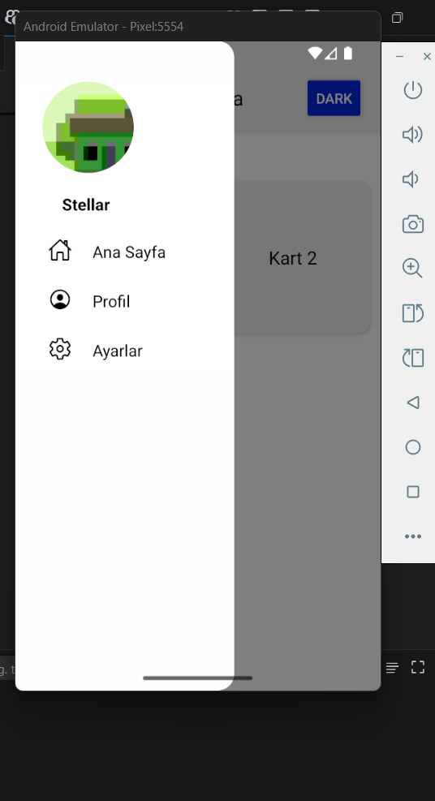
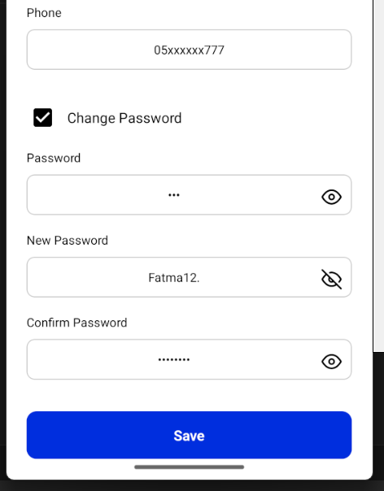

# ⛽ FuelStation IQ - Corporate Fuel Operations & Trade Manager

A high-performance **React Native (Enterprise-Grade)** application designed for corporate fuel station networks to monitor real-time operations, manage shift data, and track sales transactions with high precision.

## 🏗 System Architecture & Security
This project is built for professional environments where data integrity and security are paramount:
* **Secure Authentication:** Implemented a robust **JWT (JSON Web Token)** based auth flow.
* **Token Management:** Secured access and refresh tokens using **AsyncStorage** with industry-standard security practices.
* **Live Data Sync:** Seamless integration with RESTful APIs to handle real-time corporate data streams.

## 🛠 Technical Stack
* **Framework:** React Native & TypeScript (Strictly typed for financial data accuracy).
* **State & Cache:** **Redux Toolkit Query (RTK Query)** for advanced caching, reducing unnecessary network load for field operations.
* **Data Handling:** **Optimistic Updates** with automated rollback mechanism to ensure UI consistency during network fluctuations.
* **Localization (i18n):** Full support for internationalization, including **RTL (Right-to-Left)** languages and dynamic **Dark/Light Theme** switching.

## ✨ Business-Critical Features
* **Operation Monitoring:** Real-time tracking of fuel sales and inventory.
* **Shift Management:** Digitalized shift data entry and reporting for station employees.
* **Corporate UX:** High-speed data rendering for large transaction lists.
* **Global Readiness:** Multi-language and multi-theme support tailored for global station networks.

## 📸 Screenshots

|:---:|:---:|:---:|
|     |  |     |

## 🚀 Technical Highlights for Recruiters
* **JWT Auth:** Managing complex session states securely.
* **Performance:** Achieved near-instant UI updates using RTK Query's manual cache manipulation.
* **Architecture:** Clean separation of concerns between UI components and the API layer.
